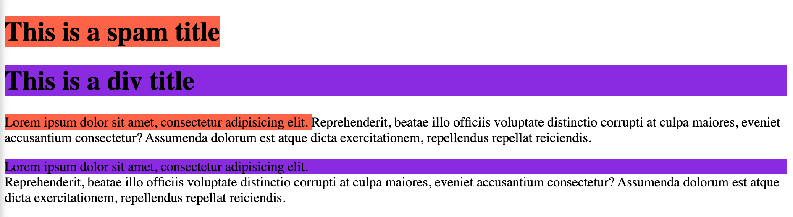

`<span>`
- **inline container** to group elements for styling purposes


`<div>`
- **division** tag
- **block container** to group elements for styling purposes
- it takes the entire width of the page

We can apply css styling enclosing between these tags.


```html
<!DOCTYPE html>
<html>
<header>
    <meta name="viewport" content="width=device-width, initial-scale=1.0">
    <title>span and div example</title>
</header>

<body>
    <h1> <span style="background-color: tomato;"> This is a spam title </span> </h1>
    <h1>
        <div style="background-color: blueviolet;"> This is a div title </div>
    </h1>
    <p> <span style="background-color: tomato;"> Lorem ipsum dolor sit amet, consectetur adipisicing elit. </span>
        Reprehenderit, beatae illo officiis voluptate
        distinctio corrupti at culpa maiores, eveniet accusantium consectetur? Assumenda dolorum est atque dicta
        exercitationem, repellendus repellat reiciendis. </p>
    <p>
        <div style="background-color: blueviolet;"> Lorem ipsum dolor sit amet, consectetur adipisicing elit. </div>
        Reprehenderit, beatae illo officiis voluptate
        distinctio corrupti at culpa maiores, eveniet accusantium consectetur? Assumenda dolorum est atque dicta
        exercitationem, repellendus repellat reiciendis.
    </p>

</body>

</html>
```

<hr>
<br>
output


