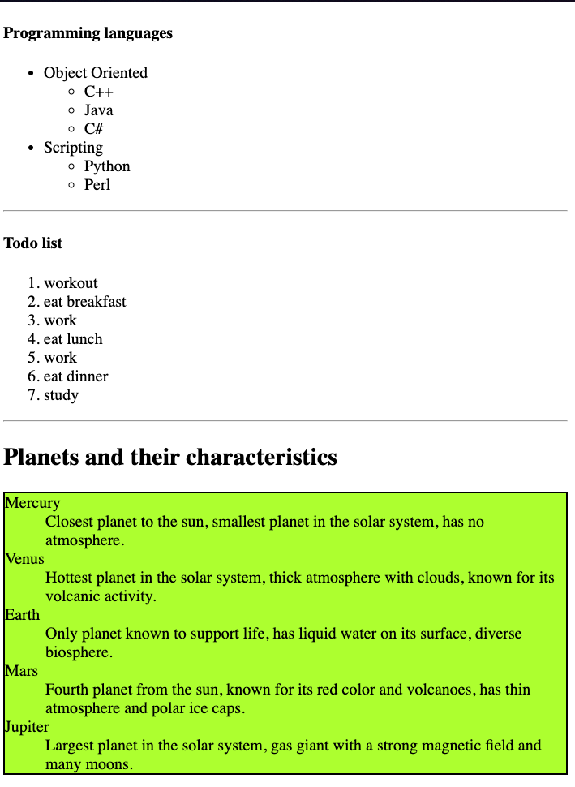

There are three types of lists
- `<ul>`
	- unordered list
	- order of items does not matter
	- e.g. grocery list
	- items are added using `<li>` (list item)
- `<ol>`
	- ordered list
	- it is a numbered list
	- items are added using `<li>`
- `<dl>`
	- description list
	- key-val pair
	- items are added using 
		- `<dt>`(description term) and 
		- `<dd>`(description definition)

```html
<!DOCTYPE html>
<html>
<header>
    <meta name="viewport" content="width=device-width, initial-scale=1.0">
    <title>list examples</title>
</header>

<body>
    <!-- unordered list -->
    <h4>Programming languages</h4>
    <ul>
        <li>Object Oriented</li>
        <ul>
            <li>C++</li>
            <li>Java</li>
            <li>C#</li>
        </ul>
        <li>Scripting</li>
        <ul>
            <li>Python</li>
            <li>Perl</li>
        </ul>
    </ul>

    <hr>

    <!-- ordered list -->
    <h4> Todo list </h4>
    <ol>
        <li> workout </li>
        <li> eat breakfast </li>
        <li> work </li>
        <li> eat lunch </li>
        <li> work </li>
        <li> eat dinner </li>
        <li> study </li>
    </ol>

    <hr>

    <!-- description list -->
    <h2>Planets and their characteristics</h2>
    <dl style="background-color: greenyellow; border: 2px solid">
        <dt>Mercury</dt>
        <dd>Closest planet to the sun, smallest planet in the solar system, has no atmosphere.</dd>
        <dt>Venus</dt>
        <dd>Hottest planet in the solar system, thick atmosphere with clouds, known for its volcanic activity.</dd>
        <dt>Earth</dt>
        <dd>Only planet known to support life, has liquid water on its surface, diverse biosphere.</dd>
        <dt>Mars</dt>
        <dd>Fourth planet from the sun, known for its red color and volcanoes, has thin atmosphere and polar ice caps.
        </dd>
        <dt>Jupiter</dt>
        <dd>Largest planet in the solar system, gas giant with a strong magnetic field and many moons.</dd>
    </dl>

</body>

</html>
```

<hr>

html output:

