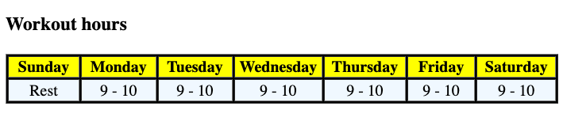

`<table>`
- `<tr>` -> rows
- `<th>` -> table header
- `<td>` -> table data
- you can use attributes like
	- `border`
	- `align`
	- `width`
	- `style`

```html
<!DOCTYPE html>
<html lang="en">

<head>
    <meta charset="UTF-8">
    <meta name="viewport" content="width=device-width, initial-scale=1.0">
    <title> tables demo </title>
</head>

<body>
    <h3> Workout hours </h3>
    <table border="1" style="background-color: black;">
        <tr align="center" style="background-color: yellow;">
            <th width=" 100"> Sunday </th>
            <th width="100"> Monday </th>
            <th width="100"> Tuesday </th>
            <th width="100"> Wednesday </th>
            <th width="100"> Thursday </th>
            <th width="100"> Friday </th>
            <th width="100"> Saturday </th>
        </tr>
        <tr align="center" style="background-color: aliceblue;">
            <td> Rest </td>
            <td> 9 - 10 </td>
            <td> 9 - 10 </td>
            <td> 9 - 10 </td>
            <td> 9 - 10 </td>
            <td> 9 - 10 </td>
            <td> 9 - 10 </td>
        </tr>
    </table>
</body>

</html>
```

<hr>

html output:
