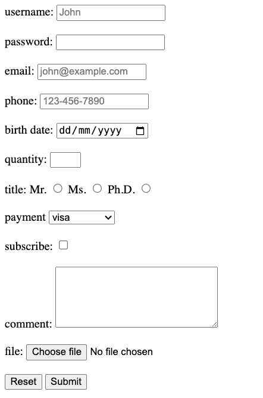

`<form>`
- `action` attribute is used to perform some action. Usually, this will take values like "index.php" or "action page"
- `method` -> GET, POST
- `enctype` ->
	- The `enctype` attribute is only used with the `POST` method. It has no effect with the `GET` method as form data is already encoded in the URL.
	- Some browsers might have limitations on file size uploads with `multipart/form-data`. Consider server-side validation and size restrictions.
	- types
		- `application/x-www-form-urlencoded`
			- This is the default and most common encoding type.
			- encodes all form data (text, numbers, etc.) into key-value pairs separated by ampersands (`&`) and encoded using URL encoding.
			- This method is suitable for simple text-based data and has limited size restrictions.
			- Use `application/x-www-form-urlencoded` for simple text-based forms without file uploads.
		- `multipart/form-data`
			- This encoding type is used when the form includes file uploads.
			- It creates a multipart message with separate parts for each form field, including text and file data.
			- Each part has its own headers and boundaries, making it suitable for handling mixed data types.
		- `text/plain`
			- This encoding type sends the entire form data as plain text without any specific format.
			- It's rarely used as it doesn't provide any structure or encoding for complex data.
			- Avoid `text/plain` due to its lack of structure and encoding.
- `input` -> **self-closing** tag to take input from the user
	- when we use `id`, when click on the label with the same name as of the id, cursor moves to the input field
	- `type`
		- `text` -> text box
		- `email`
		- `password`
		- `date`
		- `number` -> for numbers
			- `min` 
			- `max`
		- `radio`
			- `value` -> if the value is sent when we submit the form
			- `name` -> to group the radio button to select only one among many
		- `file` -> to attach file
			- `accept` -> to accept specific extension only
		- `submit` -> submit button for submitting the form
		- `reset` -> reset button for resetting the input fields within the form
	- `placeholder` -> to show greyed out text as a hint
	- `required` -> to make it mandatory field to fill
	- `minlength` -> used with text, email, password
	- `maxlength -> used with text, email, password
	- `pattern` -> used with text, email
- `label` -> to show a label to a user
	- `for` -> is used for visually impaired user
- `select` -> for dropdown menu
	- `option` -> to give different options in the dropdown menu
- `textarea` -> multiline text input field
	- `rows`
	- `cols`


```html
<!DOCTYPE html>
<html lang="en">

<head>
    <meta charset="UTF-8">
    <meta name="viewport" content="width=device-width, initial-scale=1.0">
    <title> form demo </title>
</head>

<body>
    <form action="index.php" method="POST" enctype="text/plain">
        <label for="username">username:</label>
        <input type="text" id="username" placeholder="John" minlength="6" maxlength="15" required>

        <br><br>

        <label for="password">password:</label>
        <input type="password" id="password">

        <br><br>

        <label for="email">email:</label>
        <input type="email" id="email" placeholder="john@example.com" required>

        <br><br>

        <label for="phone">phone:</label>
        <input type="tel" id="phone" placeholder="123-456-7890" pattern="[0-9]{3}-[0-9]{3}-[0-9]{4}">

        <br><br>

        <label for="birthday">birth date:</label>
        <input type="date" id="birthday">

        <br><br>

        <label for="quantity">quantity:</label>
        <input type="number" id="quantity" min="0" and max="10">

        <br><br>

        <label for="title">title: </label>
        <label for="Mr.">Mr.</label>
        <!--the value is used when we submit the form-->
        <input type="radio" id="Mr." value="Mr." name="title">

        <label for="Ms.">Ms.</label>
        <input type="radio" id="Ms." value="Ms." name="title">
        <label for="Ph.D.">Ph.D.</label>
        <input type="radio" id="Ph.D." value="Ph.D." name="title">

        <br><br>

        <label for="payment">payment</label>
        <select id="payment">
            <option value="visa">visa</option>
            <option value="mastercard">mastercard</option>
            <option value="amex">amex</option>
            <option value="giftcard">giftcard</option>
        </select>

        <br><br>

        <label id="subscribe">subscribe:</label>
        <input type="checkbox" id="subscribe">

        <br><br>

        <label for="comment">comment:</label>
        <textarea id="comment" rows="5" cols="25"></textarea>

        <br><br>

        <label for="file">file:</label>
        <input type="file" id="file" accept="image/png, image/jpeg">

        <br><br>

        <input type="reset">
        <input type="submit">
    </form>

</body>

</html>
```

<hr>

html output:
