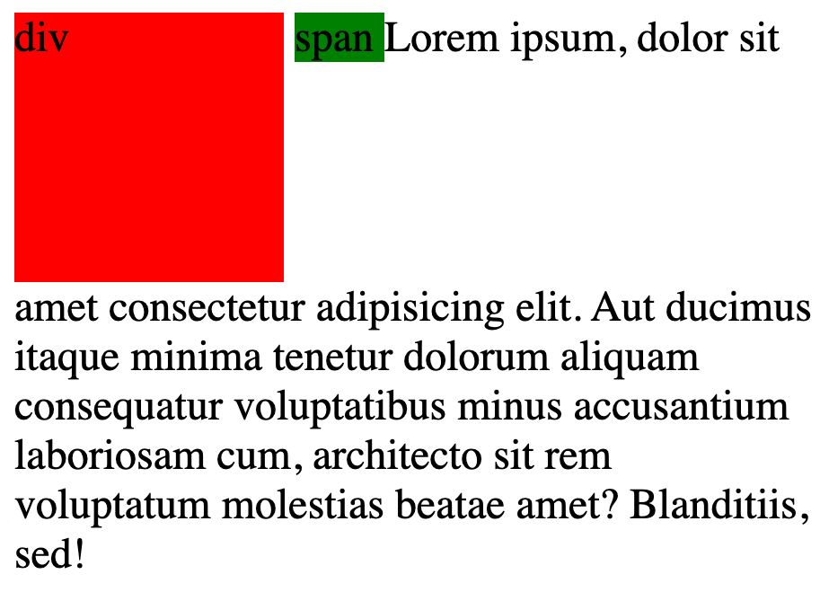
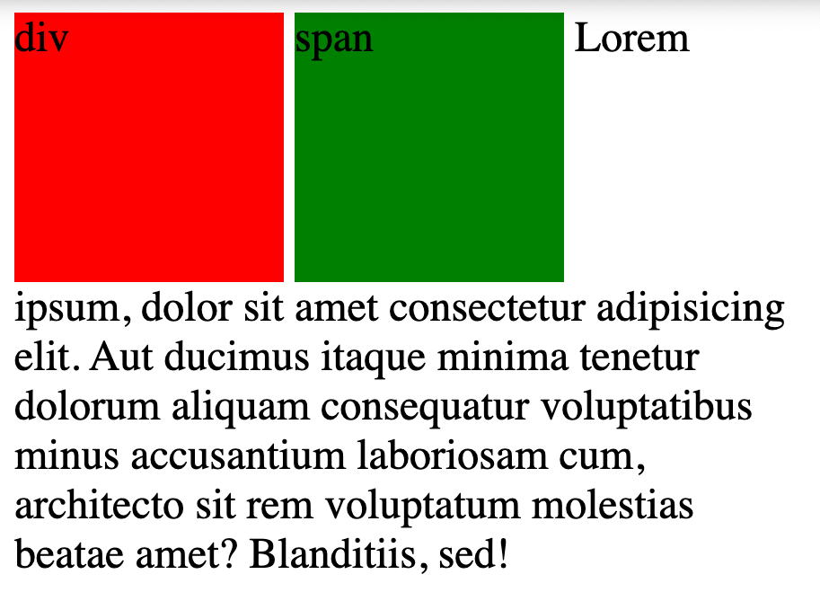

- `block-level`
	- starts on a new line
	- take up the full width available
	- you can specify the width and height to this.
	- e.g. `h1, div, p, form, header, footer`
- `inline`
	- does not start on a new line
	- width is limited to what is needed
	- if you provide width/height, it will not be applied
	- e.g. `span, a, img`


<hr> 

`display`
- specifies if/how an element is displayed
- using `display`, you can change the display of the element

- `display: block;`


- `display: inline-block;` -> div


- `display: inline-block;` -> span


- `display: inline-block;` -> div


- `display: inline-block;` -> span



- `display: none;` -> does not show the element at all


you can also use `visibility` property with `display` property.
- `display: inline-block; visibility: hidden;` -> hidden but the space is taken by the elements


<hr>


```html
<body>
    <div> div </div>
    <span> span </span>
    Lorem ipsum, dolor sit amet consectetur adipisicing elit. Aut ducimus itaque minima tenetur dolorum aliquam
    consequatur voluptatibus minus accusantium laboriosam cum, architecto sit rem voluptatum molestias beatae amet?
    Blanditiis, sed!
</body>
```


```css
div {
    background-color: red;
    width: 100px;
    height: 100px;
    /* display: block; */
    /* display: inline; */
    display: inline-block;
    visibility: hidden;
    /* display: none; */
}

span {
    background-color: green;
    width: 100px;
    height:  100px;
    /* display: block; */
    /* display: inline; */
    display: inline-block;
    /* display: none; */
}
```