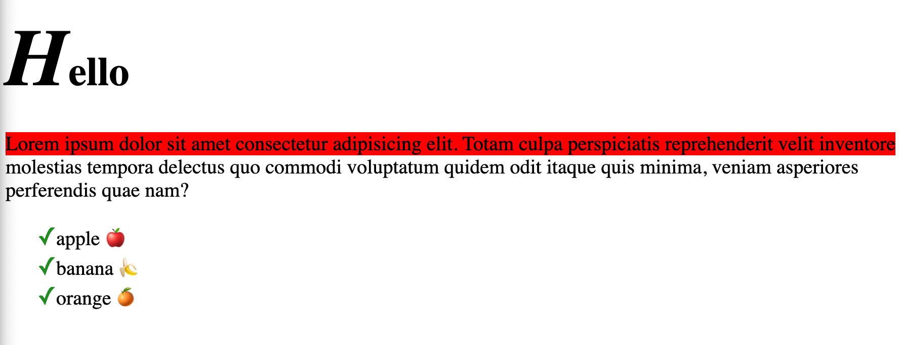

keyword added after a selector that is used to style a specific parts of an element

usage -> selector::pseudo-element

<hr>

```html
<body>
    <h1>Hello</h1>

    <p>Lorem ipsum dolor sit amet consectetur adipisicing elit. Totam culpa perspiciatis reprehenderit velit inventore
        molestias tempora delectus quo commodi voluptatum quidem odit itaque quis minima, veniam asperiores perferendis
        quae nam?
    </p>

    <ul id="fruit">
        <li id="apple"> apple </li>
        <li id="banana"> banana </li>
        <li id="orange"> orange </li>
    </ul>
</body>
```

<br>

```css
h1::first-letter{
    font-size:2em;
    font-style: italic;
}

p::first-line{
    background-color: red;;
}

/* anything selected using mouse */
p::selection{
    color:green;
    background-color: yellow;
}

/* Adding a content before the list item */
/* #fruit li::before{
    content: "☑️"; /* command + ctrl + space 
} */

/* Adding a content after the list item */
#apple::after{
    content: "🍎";
}

#banana::after{
    content: "🍌";
}

#orange::after{
    content: "🍊";
}

/* changing the bullet mark to tick mark for the list items */
#fruit li::marker {
    content: "✓";
    color: forestgreen;
    font-size: 1.2em;
}
```

<br>

html output:
