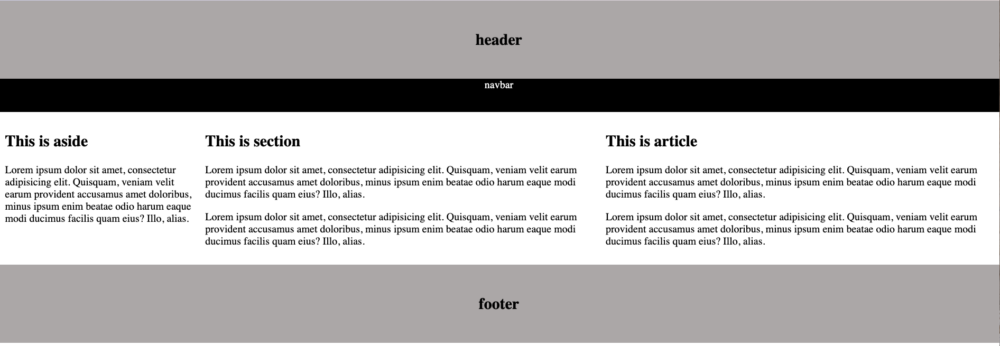
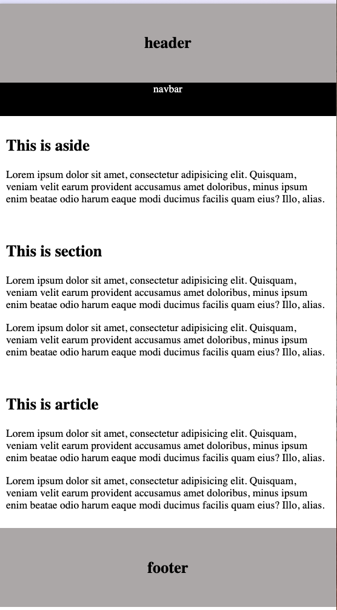

semantic tags 
- keep the content organized
- better for SEO
- assists screen reader and other tech for accessibility
`<header>` -> introductory content
`<nav>` -> navigation bar, links
`<main>` -> main content e.g. section, aside, article, div
`<section>` -> dependent content
`<aside>` -> side content
`<article>` -> independent content e.g. news article, job post , blog post
`<footer>` -> closing content e.g. author info, copyright info, nav links

<br>

`box-sizing: border-box;`
- The `box-sizing` property determines how the total width and height of an element are calculated. 
- With `box-sizing: border-box;`, the width and height properties include the content, padding, and border, but not the margin.
- This is a commonly used approach in CSS to ensure that when you set a specific width or height on an element, the padding and border are included in the calculation, resulting in more predictable layouts.


<hr>

```html
<body>
    <header>
        <h2> header </h2>
    </header>

    <nav class="navbar">
        navbar
    </nav>

    <main>
        <aside>
            <h2> This is aside </h2>
            <p>
                Lorem ipsum dolor sit amet, consectetur adipisicing elit. Quisquam, veniam velit earum provident
                accusamus amet doloribus, minus ipsum enim beatae odio harum eaque modi ducimus facilis quam eius? Illo,
                alias.
            </p>
        </aside>

        <section>
            <h2> This is section </h2>
            <p>
                Lorem ipsum dolor sit amet, consectetur adipisicing elit. Quisquam, veniam velit earum provident
                accusamus amet doloribus, minus ipsum enim beatae odio harum eaque modi ducimus facilis quam eius? Illo,
                alias.
            </p>
            <p>
                Lorem ipsum dolor sit amet, consectetur adipisicing elit. Quisquam, veniam velit earum provident
                accusamus amet doloribus, minus ipsum enim beatae odio harum eaque modi ducimus facilis quam eius? Illo,
                alias.
            </p>
        </section>

        <article>
            <h2> This is article </h2>
            <p>
                Lorem ipsum dolor sit amet, consectetur adipisicing elit. Quisquam, veniam velit earum provident
                accusamus amet doloribus, minus ipsum enim beatae odio harum eaque modi ducimus facilis quam eius? Illo,
                alias.
            </p>
            <p>
                Lorem ipsum dolor sit amet, consectetur adipisicing elit. Quisquam, veniam velit earum provident
                accusamus amet doloribus, minus ipsum enim beatae odio harum eaque modi ducimus facilis quam eius? Illo,
                alias.
            </p>
        </article>
    </main>

    <footer>
        <h2> footer </h2>
    </footer>
</body>
```


```css
* {
    box-sizing: border-box; 
}

body {
    margin: 0px;
}

header {
    background-color: rgba(124, 118, 118, 0.641);
    text-align: center;
    padding: 25px;
}

.navbar {
    background-color: black;
    height: 50px;
    color: white;
    text-align: center;
}

aside {
    width: 20%;
    float: left;
    padding: 10px;
}

section {
    width: 40%;
    float: left;
    padding: 10px;
}

article {
    width: 40%;
    float: left;
    padding: 10px;
}

footer {
    display: block;
    clear: both;
    background-color: rgba(124, 118, 118, 0.641);
    text-align: center;
    padding: 25px;
}

/* 
    for mobile devices
    responsive css
    use 100% of width for aside, section and article
*/
@media screen and (max-width: 600px) {
    aside, section, article {
        width: 100%;
    }
}
```


browser output:


mobile output:
